# ⚡ Career OS — The Builder's Codex

> **A dual-academy interactive roadmap dashboard** for tracking Software Engineering and AI Automation progress. Level up, complete quests, defeat boss battles, unlock achievements, and build a project vault — all with gamified progress tracking and persistent local storage.


---

## 🎯 Overview

Career OS transforms a 6-month career roadmap into an interactive RPG-style dashboard. It's designed for self-directed learners who want to:

- **Track progress** across two academies (Software Engineering & AI Automation)
- **Stay consistent** with daily quests and streak tracking
- **Visualize the journey** through 6 themed levels (months), each with quests, boss battles, and rewards
- **Build portfolio projects** with structured documentation and GitHub integration
- **Earn achievements** across Git, Cloud, Security, Data/AI, Portfolio, and Career categories
- **Keep momentum visible** with XP tracking, progress bars, and floating particle effects

<p align="center">
  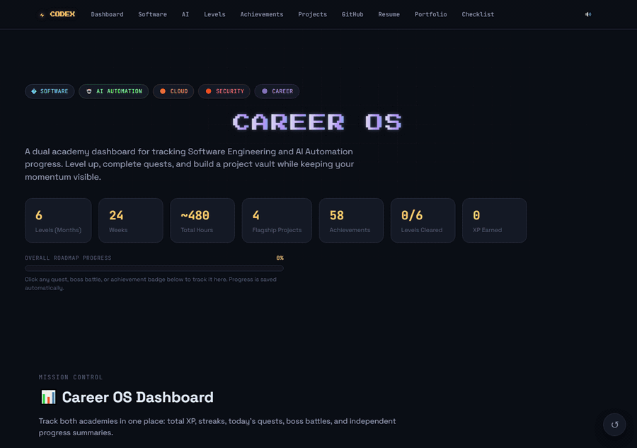
</p>

---

## 🎯 Overview

Career OS transforms a 6-month career roadmap into an interactive RPG-style dashboard. It's designed for self-directed learners who want to:

- **Track progress** across two academies (Software Engineering & AI Automation)
- **Stay consistent** with daily quests and streak tracking
- **Visualize the journey** through 6 themed levels (months), each with quests, boss battles, and rewards
- **Build portfolio projects** with structured documentation and GitHub integration
- **Earn achievements** across Git, Cloud, Security, Data/AI, Portfolio, and Career categories
- **Keep momentum visible** with XP tracking, progress bars, and floating particle effects

<p align="center">
  <i>✦ Click any quest, boss battle, or achievement badge — progress saves automatically ✦</i>
</p>

---

## 🖼️ Gallery

<p align="center">
  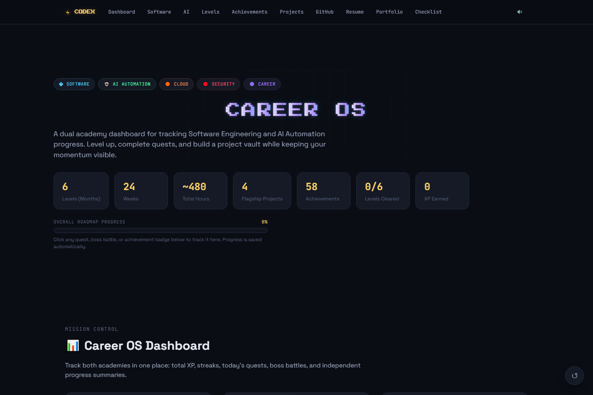
  <br>
  <em>Animated title, stat cards, and overall progress bar</em>
</p>

<table>
  <tr>
    <td width="33%">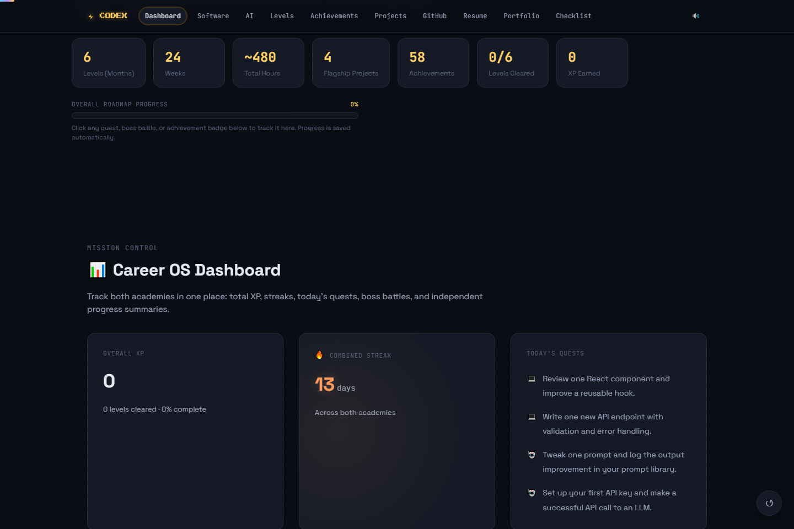<br><em>📊 Mission Control — XP, streaks, daily quests, academy progress</em></td>
    <td width="33%">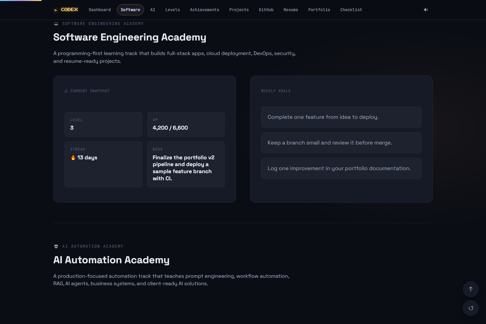<br><em>💻 Academy snapshot with level, XP, streak, and weekly goals</em></td>
    <td width="33%">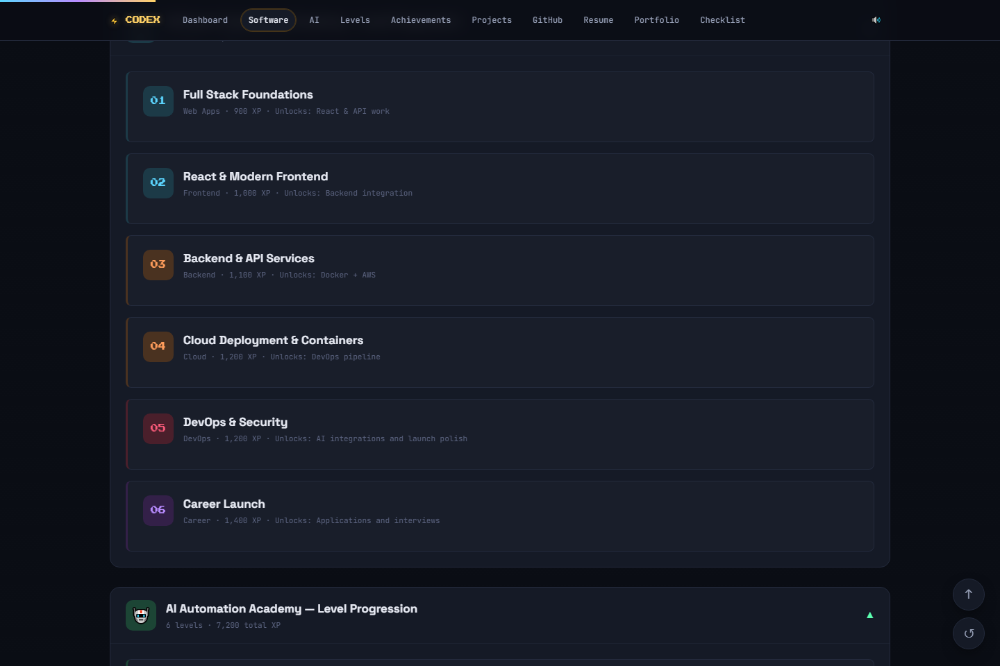<br><em>🏗️ Collapsible level progression with tech/skills/projects tracking</em></td>
  </tr>
  <tr>
    <td width="33%">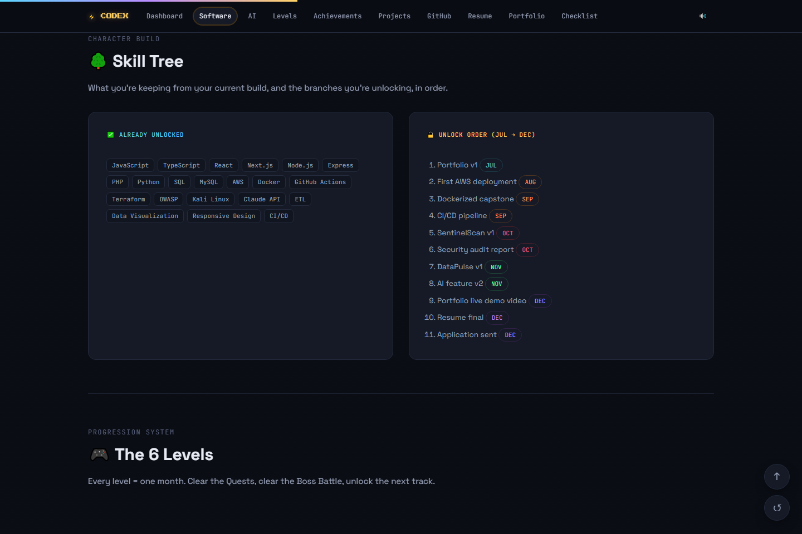<br><em>🌳 Skill tags + monthly unlock order</em></td>
    <td width="33%">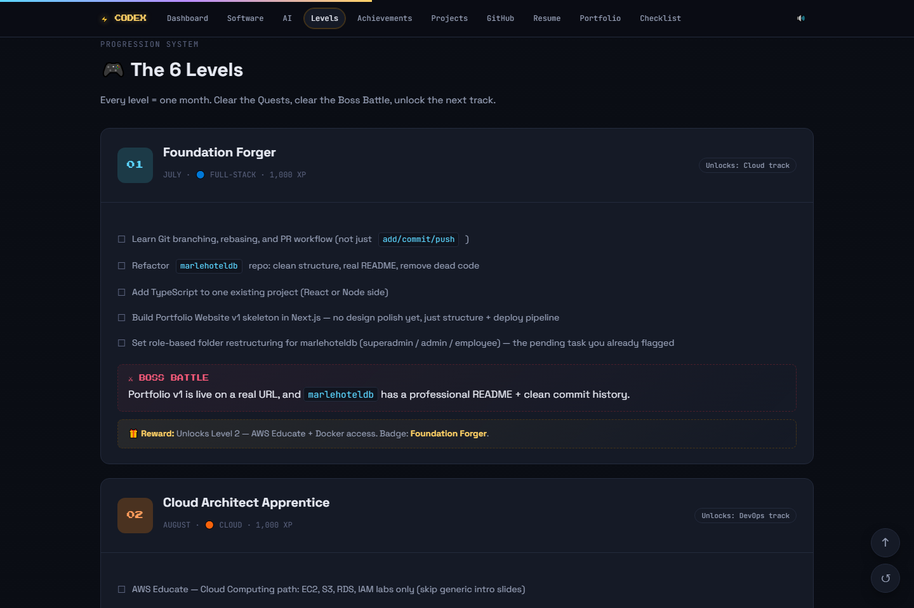<br><em>🎮 6 levels with quests, boss battles, and rewards</em></td>
    <td width="33%">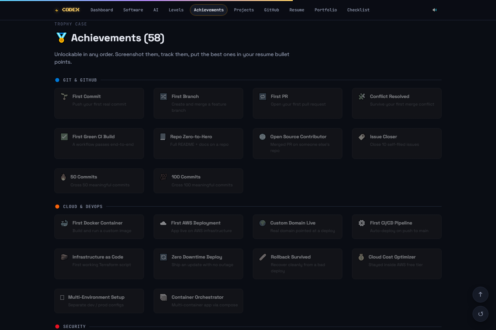<br><em>🏅 7 categories, 50+ achievements to unlock</em></td>
  </tr>
  <tr>
    <td width="33%">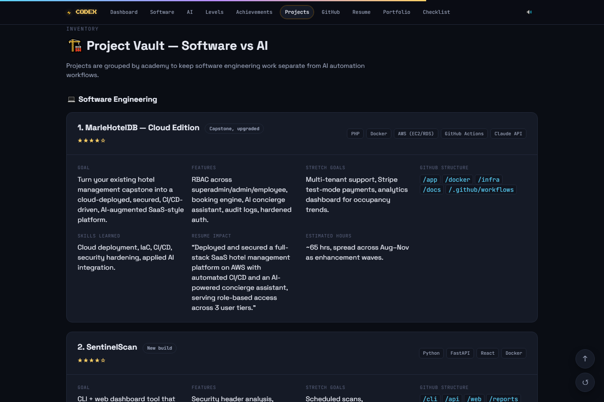<br><em>🏗️ Project vault — software vs AI groupings</em></td>
    <td width="33%">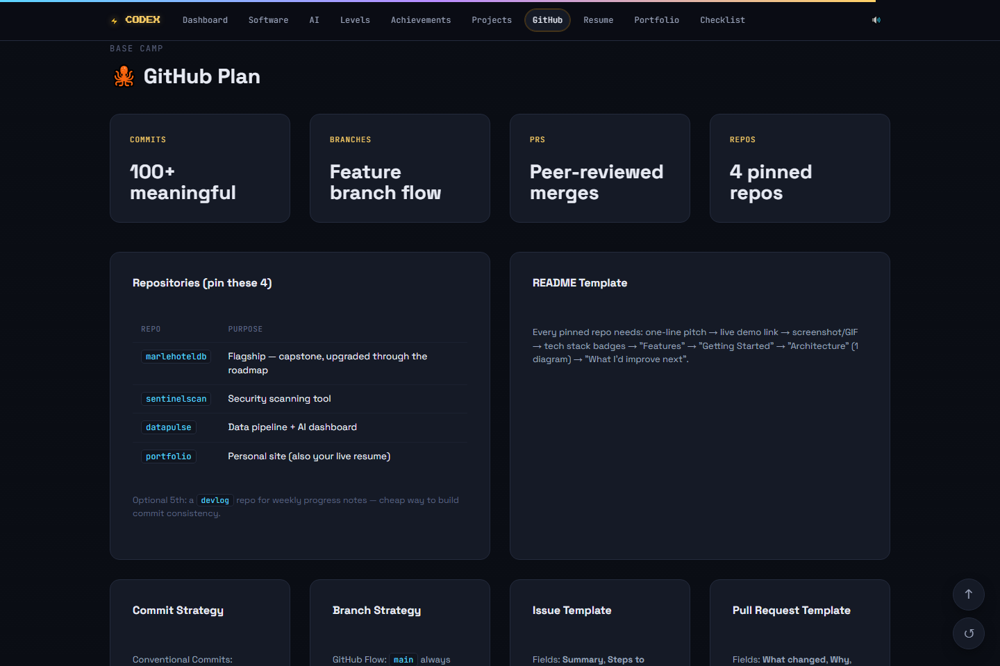<br><em>🐙 GitHub repo strategy and workflow templates</em></td>
    <td width="33%">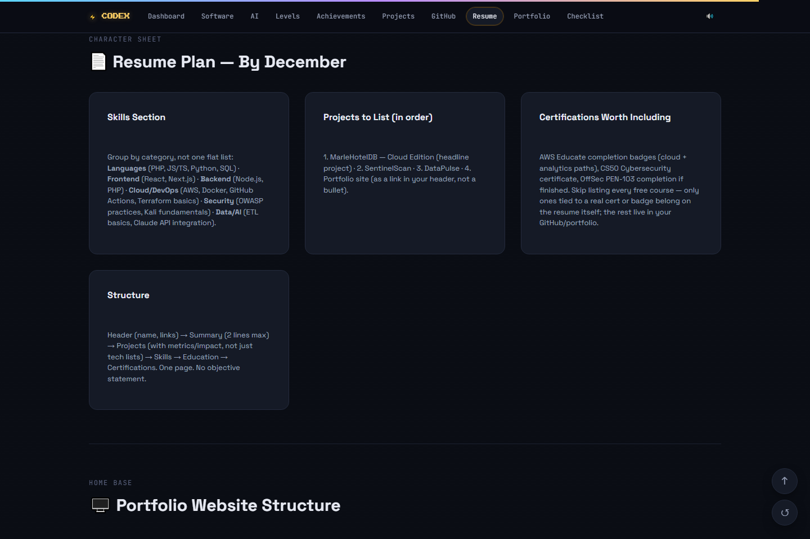<br><em>📄 Resume structure, skills, and certifications guidance</em></td>
  </tr>
  <tr>
    <td width="33%">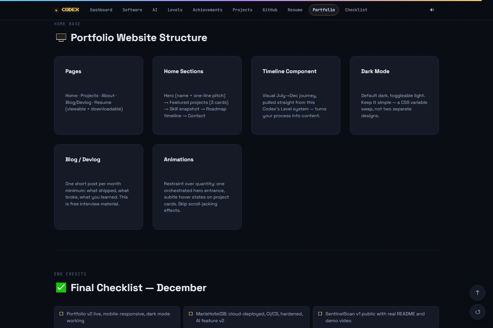<br><em>🖥️ Portfolio website structure guide</em></td>
    <td width="33%">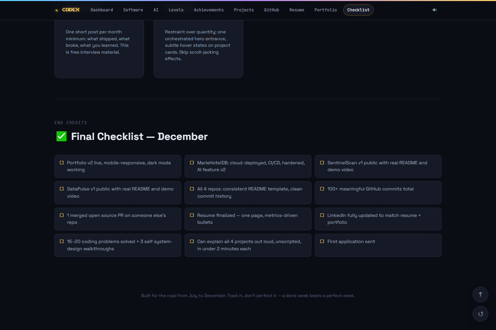<br><em>✅ Final December launch checklist</em></td>
    <td width="33%"></td>
  </tr>
</table>

<p align="center">
  <sup>All screenshots captured from the live app. Colors, layout, and content reflect the actual dashboard.</sup>
</p>

---

## ✨ Features

### 🎮 Gamified Progression
- **6 Levels (Months)** — July through December, each with a unique theme (Full-Stack → Cloud → DevOps → Security → Data/AI → Career)
- **Quest System** — Click-to-complete quests with persistent checkmarks and strikethrough animation
- **Boss Battles** — Major milestones that unlock the next level
- **Rewards** — Each level unlocks new tracks and awards unique badges
- **XP Tracking** — Real-time XP calculation based on completed quests and bosses

### 🏅 Achievement System
- **7 categories** with 50+ achievements across Git, Cloud/DevOps, Security, Data/AI, Portfolio, Consistency, and Career
- One-click unlock with fanfare sound effect and toast notifications
- Progress factored into overall completion percentage

### 📊 Dual Academies
- **Software Engineering Academy** — Full-stack, cloud, DevOps, security, and career readiness
- **AI Automation Academy** — Prompt engineering, workflow automation, RAG, AI agents, and production AI deployment
- Independent level progression, XP tracking, streak counts, and weekly goals per academy
- Collapsible per-academy level progression with tech stack, skills, and mini-projects

### 🌳 Skill Tree
- Already-unlocked skills and planned unlock order with monthly milestones
- Interactive skill tiles with rank-up animation

### 🏗️ Project Vault
- 6 flagship portfolio projects with detailed documentation
- Goal → Features → Skills Learned → Resume Impact sections per project
- Grouped by academy (Software vs AI)

### 🐙 Career Planning
- GitHub plan with repo strategy, commit conventions, branch strategy, and PR/issue templates
- Resume plan with skills section guidance, project ordering, and certification advice
- Portfolio website structure guide
- Final December launch checklist

### 🎨 Immersive UX
- Dark RPG-inspired theme with scanline overlay and pixel accents
- Motion-animated title with blur reveal
- Floating XP particles on interaction
- Click spark effects
- Sound effects (Web Audio API synthesis — no external files needed)
- Keyboard shortcut: press `S` to toggle sound
- Scroll progress indicator
- Scroll-spy active navigation
- Toast notifications for level clears and achievement unlocks
- "Back to top" FAB button
- Progress reset with confirmation dialog

### 💾 Persistent Storage
- All progress saved automatically to `localStorage` (with optional `window.storage` API support)
- Survives page refreshes and browser restarts

---

## 🛠️ Tech Stack

| Technology | Purpose |
|---|---|
| **React 19** | UI framework |
| **Vite 8** | Build tool and dev server |
| **Motion** | Animation library (Framer Motion API) |
| **Web Audio API** | Retro RPG sound effects |
| **CSS Custom Properties** | Theming system with 6 color tracks |
| **IntersectionObserver** | Scroll reveal animations and active section tracking |
| **localStorage** | Persistent progress storage |

---

## 🚀 Getting Started

### Prerequisites
- Node.js 18+
- npm, pnpm, or yarn

### Installation

```bash
# Clone the repository
git clone https://github.com/your-username/career-os.git
cd career-os

# Install dependencies
npm install

# Start the development server
npm run dev
```

Open `http://localhost:5173` in your browser.

### Building for production

```bash
npm run build
npm run preview
```

---

## 📁 Project Structure

```
src/
├── components/
<<<<<<< HEAD
│   └── BlurText.jsx          # Animated text reveal component
├── data/
│   ├── academies.js           # Academy configuration (Software + AI)
│   ├── achievements.js        # 50+ achievements across 7 categories
│   ├── aiAutomationAcademy.js # AI Automation Academy: 6 levels, skills, projects
│   ├── careerContent.js       # Career planning: GitHub, resume, portfolio, checklist
│   ├── dailyQuests.js         # Daily quest types and low-energy options
│   ├── index.js               # Re-export barrel
│   ├── levels.js              # 6 monthly levels with quests and boss battles
│   ├── misc.js                # Color tokens, nav links, storage key
│   ├── monthlyRoadmap.js      # Week-by-week roadmap for all 6 months
│   ├── projects.js            # 6 flagship portfolio projects
│   └── softwareAcademy.js     # Software Engineering Academy: 6 levels, skills, projects
├── hooks/
│   ├── Reveal.jsx             # Scroll-reveal wrapper component
│   ├── useClickSparks.js      # Mouse click particle effects
│   ├── useCodexProgress.js    # Central progress state (quests, bosses, achievements)
│   ├── useFloatingXP.js       # Floating "+XP" particle system
│   ├── useReveal.js           # IntersectionObserver scroll-reveal hook
│   ├── useSounds.js           # Web Audio API sound synthesis
│   └── useToast.js            # Toast notification hook
├── App.css                    # Legacy styles (minimal)
├── App.jsx                    # Main application component
├── index.css                  # Complete theme and layout styles
└── main.jsx                   # React entry point
│   ├── Dashboard.jsx              # Mission Control — XP, streaks, today's quests
│   ├── AcademyOverview.jsx        # Academy snapshot cards
│   ├── AcademyLevelProgression.jsx # Collapsible level-by-level progression
│   ├── SkillTree.jsx              # Skill tags + unlock order
│   ├── LevelsSection.jsx          # 6 levels with quests, bosses, rewards
│   ├── Achievements.jsx           # Trophy case across 7 categories
│   ├── Projects.jsx               # Project vault — software vs AI
│   ├── GitHubPlan.jsx             # GitHub repo strategy
│   ├── ResumePlan.jsx             # Resume planning cards
│   ├── PortfolioSection.jsx       # Portfolio structure guide
│   ├── FinalChecklist.jsx         # December launch checklist
│   └── BlurText.jsx               # Animated text reveal component
├── data/
│   ├── academies.js               # Academy configuration (Software + AI)
│   ├── achievements.js            # 50+ achievements across 7 categories
│   ├── aiAutomationAcademy.js     # AI Automation Academy: 6 levels, skills, projects
│   ├── careerContent.js           # Career planning: GitHub, resume, portfolio, checklist
│   ├── dailyQuests.js             # Daily quest types and low-energy options
│   ├── index.js                   # Re-export barrel
│   ├── levels.js                  # 6 monthly levels with quests and boss battles
│   ├── misc.js                    # Color tokens, nav links, storage key
│   ├── monthlyRoadmap.js          # Week-by-week roadmap for all 6 months
│   ├── projects.js                # 6 flagship portfolio projects
│   └── softwareAcademy.js         # Software Engineering Academy: 6 levels, skills, projects
├── hooks/
│   ├── Reveal.jsx                 # Scroll-reveal wrapper component
│   ├── useClickSparks.js          # Mouse click particle effects
│   ├── useCodexProgress.js        # Central progress state (quests, bosses, achievements)
│   ├── useFloatingXP.js           # Floating "+XP" particle system
│   ├── useReveal.js               # IntersectionObserver scroll-reveal hook
│   ├── useSounds.js               # Web Audio API sound synthesis
│   └── useToast.js                # Toast notification hook
├── utils/
│   └── rich.jsx                   # Markdown-like text rendering helper
├── App.jsx                        # Main application component
├── index.css                      # Complete theme and layout styles
└── main.jsx                       # React entry point
>>>>>>> db78518 ([200~added dark/light mode, sound effects via Web Audio API + keyboard shortcuts (S/T), Demo GIF + 12-screenshot gallery in the README, Responsive layout.)
```

---

## 🎮 How to Use

1. **Browse the dashboard** — See overall progress, combined streaks, today's quests, and academy summaries at a glance.
2. **Complete quests** — Click any quest item to mark it complete. It'll cross off with a satisfying animation.
3. **Defeat bosses** — Click the boss battle card in each level to mark that month's major milestone as cleared.
4. **Unlock achievements** — Click achievement badges to track them. They'll light up with a fanfare sound.
5. **Track skills** — In the academy level progression, click tech stack items, skills, and mini-projects to rank them up.
6. **Reset progress** — Click the ↺ button in the bottom-right corner (confirmation required).
7. **Toggle sound** — Click the 🔊/🔇 button in the nav bar, or press `S` on your keyboard.

> All progress is saved automatically in your browser. No account needed.

---

## 📚 Academies

### 💻 Software Engineering Academy
A programming-first learning track covering:
- Full-stack development (React, Next.js, Node.js, PHP)
- Cloud deployment (AWS, Docker)
- DevOps (GitHub Actions, CI/CD, Terraform)
- Security (OWASP, Kali Linux)
- Career readiness (resume, portfolio, interview prep)

**Flagship Projects:** MarleHotelDB Cloud Edition, SentinelScan, Portfolio Website v2

### 🤖 AI Automation Academy
A production-focused automation track covering:
- Prompt engineering (GPT-4, Claude, Gemini)
- Workflow automation (n8n, REST APIs, webhooks)
- RAG & AI agents (LangChain, LangGraph, ChromaDB, Pinecone)
- Business automation systems
- Production AI deployment (Docker, monitoring, CI/CD)
- AI consulting & architecture

**Flagship Projects:** AI Prompt Library, Multi-Agent RAG System, Business Automation Suite, AI SaaS Platform

---

## 🗺️ The 6 Levels

| Level | Month | Theme | Color | Focus |
|---|---|---|---|---|
| 01 | July | Foundation Forger | 🔵 Full-Stack | Git, TypeScript, Portfolio v1 |
| 02 | August | Cloud Architect Apprentice | 🟠 Cloud | AWS, Docker, Deployment |
| 03 | September | DevOps Engineer | 🟠 DevOps | CI/CD, IaC, Tests |
| 04 | October | Security Sentinel | 🔴 Security | OWASP, Kali, SentinelScan |
| 05 | November | Data & AI Engineer | 🟢 Data/AI | ETL, AI APIs, DataPulse |
| 06 | December | Job-Ready Professional | 🟣 Career | Resume, Portfolio v2, Applications |

---

## 🖌️ Theme

Career OS features a custom dark RPG-inspired theme with:

- **6 color tracks** — distinct accent colors for each roadmap theme
- **Press Start 2P** — pixel font for display text
- **JetBrains Mono** — monospace for data and labels
- **Space Grotesk** — body copy
- **Scanline overlay** — subtle CRT texture
- **Grid background** — radial gradients and grid lines on the hero
- **Particle effects** — floating XP text and click sparks

---

## 🧠 Architecture Notes

- **State management** — All progress lives in `useCodexProgress` (a custom hook using React `useState` + `useMemo` + `useCallback`). No external state library needed.
- **Persistence** — Priority: `window.storage` API → `localStorage` fallback. Data is serialized as JSON and written on every state change.
- **Sound** — Synthesized at runtime via the Web Audio API. Zero audio files to load.
- **Animations** — CSS transitions and the `motion` library. IntersectionObserver for scroll-triggered reveals.
- **Responsive** — CSS Grid with `auto-fit`/`minmax` for adaptive layouts. Works on desktop and tablet.

---

## 📄 License

MIT — free to use, modify, and share.

---

<p align="center">
  <b>Built for the road from July to December.</b><br>
  <i>Track it, don't perfect it — a done week beats a perfect week.</i>
</p>
